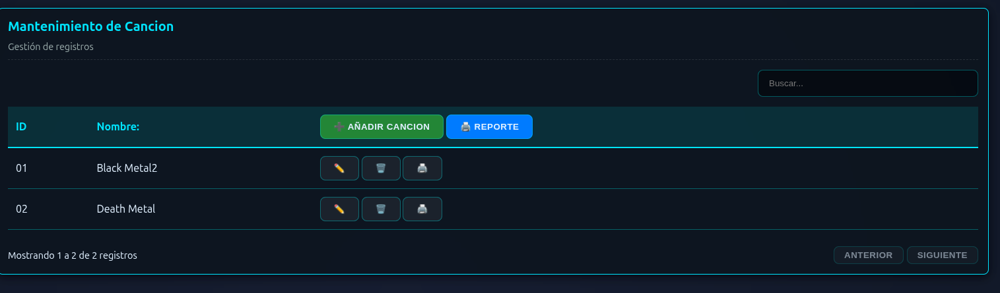

# Guía para crear un CRUD en Jettra: Ejemplo Cancion

En este documento se explica paso a paso cómo crear un CRUD (Create, Read, Update, Delete) utilizando JettraStack, tomando como ejemplo la entidad `Cancion`.

El proceso consta de 3 pasos principales:
1. Crear el Modelo (`CancionModel`)
2. Crear el Repositorio (`CancionRepository`)
3. Definir la Vista CRUD (`CancionPageDef`)

---

## 1. Creación del Modelo (`CancionModel`)

El modelo representa la estructura de los datos. En Jettra, se utiliza la anotación `@JettraViewModel` para indicar que la clase es un modelo de vista. Además, se pueden aplicar anotaciones de validación (como `@NotNull`, `@Size`) y de propiedades para la interfaz gráfica (como `@PropertiesLabel`).

### Ejemplo: `CancionModel.java`

Ubicación: `src/main/java/com/jettra/example/model/crudview/CancionModel.java`

```java
package com.jettra.example.model.crudview;

import io.jettra.wui.core.annotations.JettraViewModel;
import io.jettra.wui.core.annotations.PropertiesLabel;
import io.jettra.wui.validations.NotNull;
import io.jettra.wui.validations.Size;
import java.util.Objects;

@JettraViewModel
public class CancionModel {
    @NotNull
    @Size(min = 2, max = 5)
    @PropertiesLabel(value = "lbl.id", label = "ID")
    private String id;
    
    @NotNull
    @Size(min = 3, max = 100)
    @PropertiesLabel(value = "lbl.name", label = "Nombre Cancion")
    private String name;

    public CancionModel() {
    }

    public CancionModel(String id, String name) {
        this.id = id;
        this.name = name;
    }

    public String getId() {
        return id;
    }

    public void setId(String id) {
        this.id = id;
    }

    public String getName() {
        return name;
    }

    public void setName(String name) {
        this.name = name;
    }

    @Override
    public int hashCode() {
        int hash = 3;
        hash = 83 * hash + Objects.hashCode(this.id);
        hash = 83 * hash + Objects.hashCode(this.name);
        return hash;
    }

    @Override
    public boolean equals(Object obj) {
        if (this == obj) {
            return true;
        }
        if (obj == null) {
            return false;
        }
        if (getClass() != obj.getClass()) {
            return false;
        }
        final CancionModel other = (CancionModel) obj;
        if (!Objects.equals(this.id, other.id)) {
            return false;
        }
        return Objects.equals(this.name, other.name);
    }

    @Override
    public String toString() {
        return "Canciones{" + "id=" + id + ", name=" + name + '}';
    }
}
```

**Puntos clave:**
- **`@JettraViewModel`**: Define la clase como un modelo administrado por Jettra.
- **`@PropertiesLabel`**: Asigna una etiqueta visual para los campos generados en la interfaz de usuario.
- **Validaciones**: Se utilizan validaciones estándar como `@NotNull` y `@Size` para asegurar la integridad de los datos.

---

## 2. Creación del Repositorio (`CancionRepository`)

El repositorio actúa como el encargado de manejar las operaciones de acceso a datos para nuestro modelo (buscar, guardar, eliminar). En este ejemplo, los datos se manejan estáticamente en memoria mediante una lista, pero en un caso real se conectarían a una base de datos.

### Ejemplo: `CancionRepository.java`

Ubicación: `src/main/java/com/jettra/example/repository/crud/CancionRepository.java`

```java
package com.jettra.example.repository.crud;

import com.jettra.example.model.crudview.CancionModel;
import java.util.ArrayList;
import java.util.List;

public class CancionRepository {
    private static final List<CancionModel> cancions = new ArrayList<>();
    
    // Inicialización de datos de prueba
    static {
        cancions.add(new CancionModel("01", "Black Metal"));
        cancions.add(new CancionModel("02", "Death Metal"));
    }
    
    public static List<CancionModel> findAll(){
        return new ArrayList<>(cancions);
    }
    
    public static CancionModel findById(String id){
        return cancions.stream().filter(c -> c.getId().equals(id)).findFirst().orElse(null);
    }
    
    public static void save(CancionModel cancionModel){
        CancionModel existing = findById(cancionModel.getId());
        if(existing != null){
            existing.setName(cancionModel.getName());
        } else {
            cancions.add(cancionModel);
        }
    }
    
    public static void delete(String id){
        cancions.removeIf(c -> c.getId().equals(id));
    }
}
```

**Puntos clave:**
- Es necesario proporcionar métodos estándar (como `findAll()`, `findById()`, `save()` y `delete()`) para que el framework pueda invocar las acciones básicas del CRUD.

---

## 3. Definición de la Vista CRUD (`CancionPageDef`)

Finalmente, se define una interfaz que actúa como configuración para generar automáticamente la página o vista CRUD. Aquí enlazamos nuestro modelo con su respectivo repositorio y ajustamos parámetros visuales o de reportes.

### Ejemplo: `CancionPageDef.java`

Ubicación: `src/main/java/com/jettra/example/pages/cruview/CancionPageDef.java`

```java
package com.jettra.example.pages.cruview;

import com.jettra.example.dashboard.DashboardBasePage;
import io.jettra.wui.core.annotations.CrudView;
import io.jettra.wui.sync.JettraPageSincronized;
import io.jettra.wui.sync.SyncType;

@JettraPageSincronized(SyncType.ALL)
@CrudView(
    extendsClass = DashboardBasePage.class, 
    model = com.jettra.example.model.crudview.CancionModel.class,
    repository = com.jettra.example.repository.crud.CancionRepository.class,
    report = true,
    reportOrientation = "LANDSCAPE",
    reportTitle = "INFORME GLOBAL DE CANCIONES",
    reportHeaderColor = "#007BFF"
)
public interface CancionPageDef {
    
}
```

**Puntos clave:**
- **`@CrudView`**: Esta anotación es el núcleo generador de la vista. Se encarga de enlazar la página base de tu dashboard (`extendsClass`), el modelo de datos (`model`), y las operaciones de datos (`repository`).
- **Opciones de Reportes**: Permite habilitar y configurar la descarga de reportes PDF estableciendo título, orientación de la página, colores, etc.
- **`@JettraPageSincronized`**: Habilita la sincronización en tiempo real de la página, por ejemplo, si ocurre un cambio en los datos desde otra sesión o usuario.

---


# Vista generada




## 4. Clases Generadas por JettraStack

A partir de la definición de `CancionPageDef` y sus anotaciones, JettraStack genera automáticamente clases subyacentes durante el proceso de compilación (generalmente en `target/generated-sources/annotations`). Estas clases son las encargadas de construir la interfaz web real y enlazar los eventos del CRUD a tu repositorio.

A continuación, se muestran ejemplos de las clases que Jettra genera automáticamente:

### 4.1. `CancionPage.java`

Esta es la clase que representa la vista web propiamente dicha. Extiende la clase base configurada (`DashboardBasePage`) y se encarga de crear el componente visual (`io.jettra.wui.complex.CrudView`). Se configuran las opciones de reporte, si es editable, y se añade al centro de la página.

```java
package com.jettra.example.pages.cruview;

import com.jettra.example.dashboard.DashboardBasePage;
import com.jettra.example.model.crudview.CancionModel;
import com.jettra.example.repository.crud.CancionRepository;
import io.jettra.wui.complex.Center;
import io.jettra.wui.core.annotations.CrudView;
import io.jettra.wui.core.annotations.InjectProperties;
import io.jettra.wui.sync.JettraPageSincronized;
import io.jettra.wui.sync.SyncType;
import java.lang.Override;
import java.lang.String;
import java.util.Properties;

@JettraPageSincronized(SyncType.ALL)
@CrudView(
    model = CancionModel.class,
    autoRender = false,
    editable = false,
    report = true,
    reportOrientation = "LANDSCAPE",
    reportTitle = "INFORME GLOBAL DE CANCIONES",
    reportHeaderColor = "#007BFF",
    repository = CancionRepository.class
)
public class CancionPage extends DashboardBasePage implements CancionPageDef {
  @InjectProperties(
      name = "messages"
  )
  private Properties msg;

  public CancionPage() {
    super("");
  }

  @Override
  protected void initCenter(Center center, String username) {
    CancionPageDefCrudHandler handler = new CancionPageDefCrudHandler();
    io.jettra.wui.complex.CrudView crudComponent = new io.jettra.wui.complex.CrudView(CancionModel.class, CancionRepository.class, msg, handler);
    crudComponent.setEditable(false);
    crudComponent.setReportEnabled(true);
    crudComponent.setReportShowViewer(true);
    crudComponent.setReportAllowPrint(true);
    crudComponent.setReportAllowPdf(true);
    crudComponent.setReportAllowExcel(true);
    crudComponent.setReportAllowCsv(true);
    crudComponent.setReportAllowWord(true);
    crudComponent.setReportOrientation("LANDSCAPE");
    crudComponent.setReportCustomTitle("INFORME GLOBAL DE CANCIONES");
    crudComponent.setReportHeaderColor("#007BFF");
    crudComponent.setParentPage(this);
    crudComponent.build();
    center.add(crudComponent);
  }
}
```

### 4.2. `CancionPageDefCrudHandler.java`

Esta clase implementa la interfaz `CrudHandler` de Jettra y es responsable de actuar como puente entre la interfaz visual y el repositorio. Proporciona mapeos automáticos de atributos usando reflexión y realiza las operaciones directas de `findAll`, `save` y `delete` hacia `CancionRepository`.

```java
package com.jettra.example.pages.cruview;

import com.jettra.example.model.crudview.CancionModel;
import com.jettra.example.repository.crud.CancionRepository;
import io.jettra.wui.core.annotations.CrudHandler;
import io.jettra.wui.core.annotations.FieldMetadata;
import java.lang.Object;
import java.lang.Override;
import java.lang.String;
import java.util.ArrayList;
import java.util.HashMap;
import java.util.List;
import java.util.Map;

public class CancionPageDefCrudHandler implements CrudHandler<CancionModel> {
  @Override
  public List<CancionModel> findAll() {
    return CancionRepository.findAll();
  }

  @Override
  public void save(CancionModel model) {
    CancionRepository.save(model);
  }

  @Override
  public void delete(String id) {
    CancionRepository.delete(id);
  }

  @Override
  public String getIdValue(CancionModel item) {
    Object val = getFieldValue(item, "code");
    if (val != null) return val.toString();
    val = getFieldValue(item, "id");
    if (val != null) return val.toString();
    return "0";
  }

  @Override
  public Map<String, String> getJsonMap(CancionModel item) {
    Map<String, String> map = new HashMap<>();
    Object val_id = getFieldValue(item, "id");
    map.put("id", val_id != null ? val_id.toString() : "");
    Object val_name = getFieldValue(item, "name");
    map.put("name", val_name != null ? val_name.toString() : "");
    return map;
  }

  @Override
  public CancionModel createInstance() {
    return new CancionModel();
  }

  @Override
  public void updateFields(CancionModel model, Map<String, String> data) {
    for (var entry : data.entrySet()) {
      try {
        switch (entry.getKey()) {
          case "id":
            setFieldValue(model, "id", entry.getValue());
            break;
          case "name":
            setFieldValue(model, "name", entry.getValue());
            break;
        }
      } catch (Exception e) {
      }
    }
  }

  @Override
  public List<FieldMetadata> getFieldsMetadata() {
    List<FieldMetadata> list = new ArrayList<>();
    FieldMetadata fm_id = new FieldMetadata("id", String.class);
    fm_id.propertiesLabelValue = "lbl.id";
    fm_id.propertiesLabelLabel = "ID";
    list.add(fm_id);
    FieldMetadata fm_name = new FieldMetadata("name", String.class);
    fm_name.propertiesLabelValue = "lbl.name";
    fm_name.propertiesLabelLabel = "Nombre Cancion";
    list.add(fm_name);
    return list;
  }

  @Override
  public Object getFieldValue(CancionModel item, String fieldName) {
    switch (fieldName) {
      case "id": return item.getId();
      case "name": return item.getName();
      default: return null;
    }
  }

  @Override
  public void setFieldValue(CancionModel item, String fieldName, Object value) {
    switch (fieldName) {
      case "id": item.setId((String) value); break;
      case "name": item.setName((String) value); break;
    }
  }

  @Override
  public Object getNestedFieldValue(Object item, String fieldName) {
    return null;
  }

  @Override
  public void setNestedFieldValue(Object item, String fieldName, Object value) {
  }

  @Override
  public FieldMetadata getNestedFieldMetadata(Object item, String fieldName) {
    return null;
  }
}
```

### 4.3. `CancionPageCrudHandler.java`

El procesador de anotaciones también puede generar variaciones del manejador dependiendo del tipo de entidades y anotaciones extra encontradas. Esta clase es estructuralmente similar a la anterior y Jettra utiliza la que mejor se adapte en el contexto de inyección.

```java
package com.jettra.example.pages.cruview;

import com.jettra.example.model.crudview.CancionModel;
import com.jettra.example.repository.crud.CancionRepository;
import io.jettra.wui.core.annotations.CrudHandler;
import io.jettra.wui.core.annotations.FieldMetadata;
import java.lang.Object;
import java.lang.Override;
import java.lang.String;
import java.util.ArrayList;
import java.util.HashMap;
import java.util.List;
import java.util.Map;

public class CancionPageCrudHandler implements CrudHandler<CancionModel> {
  @Override
  public List<CancionModel> findAll() {
    return CancionRepository.findAll();
  }

  @Override
  public void save(CancionModel model) {
    CancionRepository.save(model);
  }

  // ... (los demás métodos generados son similares a CancionPageDefCrudHandler) ...
}
```
